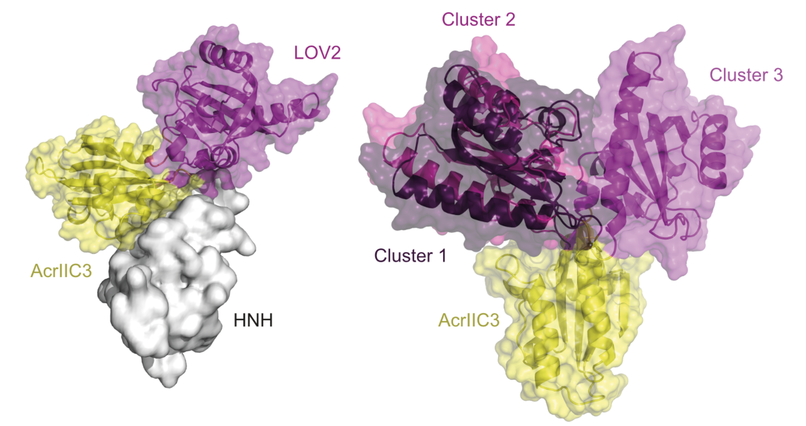

# CASANOVA-C3

Repository for the computational part of the paper 

Mareike D. Hoffmann, Jan Mathony, Julius Upmeier zu Belzen, Zander Harteveld, Christina Stengl, Bruno E. Correia, Roland Eils and Dominik Niopek. 2019. *Optogenetic control of Neisseria meningitidis Cas9 genome editing using an engineered, light-switchable anti-CRISPR protein.*

**Computational models of AcrIIC3-LOV2 hybrids**
> We used the Rosetta remodel application (51) to generate the AcrIIC3-LOV2 domain insertions based on the structures for AcrIIC3 (PDB 6J9N) and the LOV2 domain (PDB 2V0W). The N-terminus of the LOV2 structure contained three residues that were not part of our final design and thus omitted. Terminal regions of the LOV2 domain were rebuilt, including the added glycine-linkers. For rebuilding, fragment insertion with cyclic coordinate descent (52) and kinematic closure (53, 54) with default parameters were used. For each of the variants, 1000 decoys were generated, of which 236 passed the chain-break filter for CN-C3G and 206 for the direct fusion CN-C3. These were subsequently clustered with a root mean square deviation (r.m.s.d) threshold of 5 Å into 17 clusters for CN-C3G and 8 clusters for the direct fusion CN-C3. 

**References**

51. Huang,P.S., Ban,Y.E.A., Richter,F., Andre,I., Vernon,R., Schief,W.R. and Baker,D. (2011) Rosettaremodel: A generalized framework for flexible backbone protein design. PLoS One, 6.
52. Canutescu,A.A. and Dunbrack,R.L. (2003) Cyclic coordinate descent: A robotics algorithm for protein loop closure. Protein Sci., 12, 963–972.
53. Coutsias,E.A., Seok,C., Jacobson,M.P. and Dill,K.A. (2004) A Kinematic View of Loop Closure. J. Comput. Chem., 25, 510–528.
54. Mandell,D.J., Coutsias,E.A. and Kortemme,T. (2009) Sub-angstrom accuracy in protein loop reconstruction by robotics-inspired conformational sampling. Nat. Methods, 6, 551–552.
